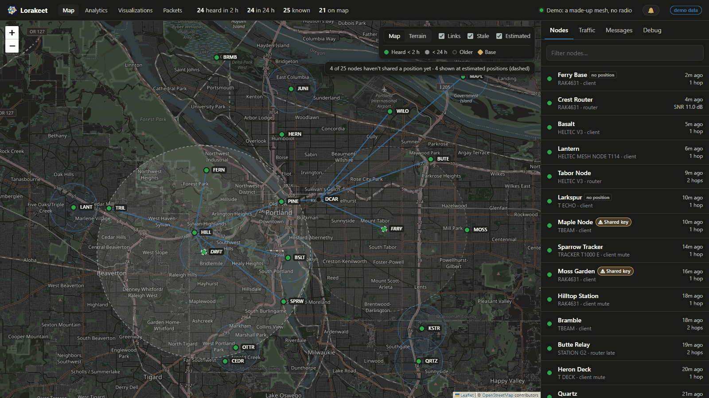
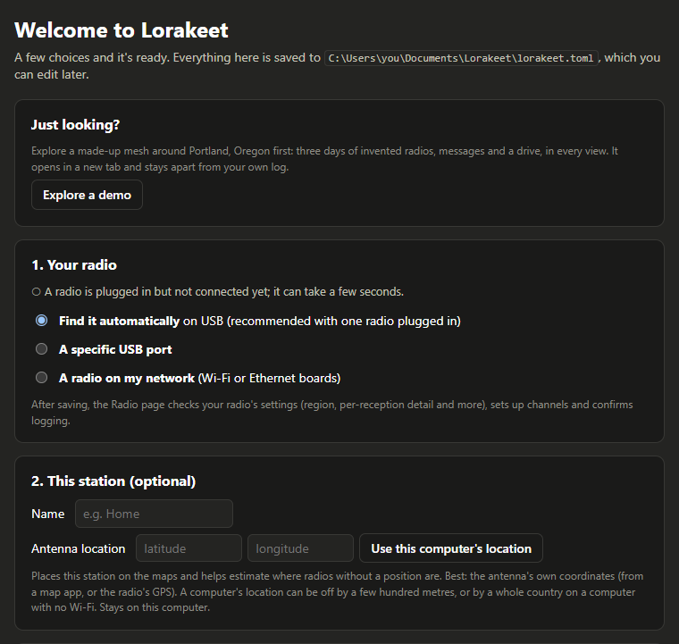
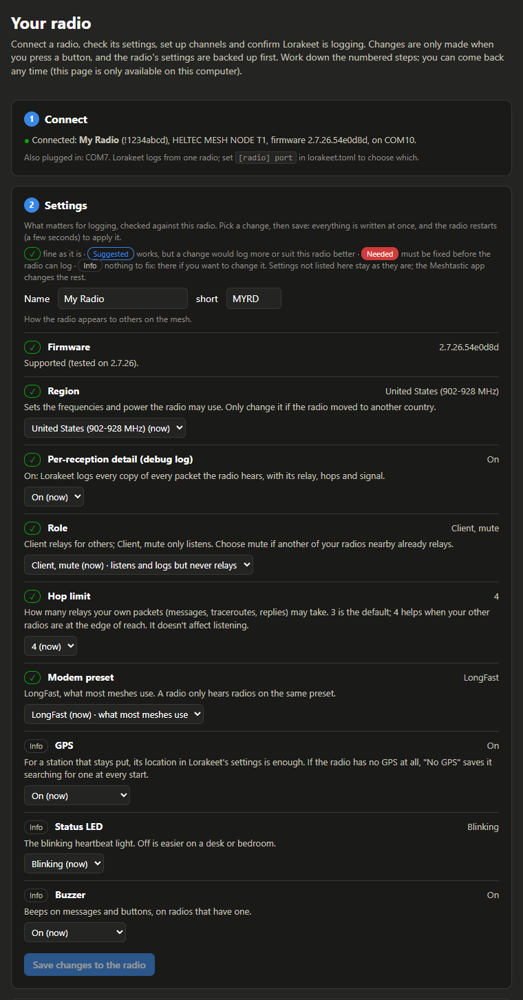
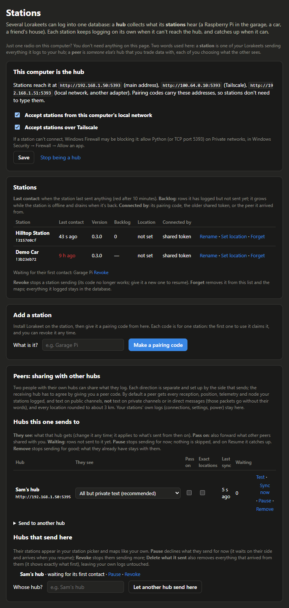

#  Lorakeet

[](https://github.com/darthnut/lorakeet/actions/workflows/tests.yml)

*LoRa + lorikeet: a chatty bird that sits on your mesh and listens to everything.*

Lorakeet is a logger and dashboard for a [Meshtastic](https://meshtastic.org) mesh. Plug a radio into a
computer and it records **everything that radio hears** (every packet, every over-the-air reception
including duplicates, the radio's own debug log) into SQLite, then lets you explore it: a live map,
analytics, the mesh's real topology, packet-level detail and an animated replay of the traffic.

> **Preview.** It works and runs every day, but it's young: expect rough edges. Feedback and bug reports are
> welcome. No radio yet? The setup page's **Explore a demo** shows every view on a made-up mesh.

The videos and most screenshots here come from a real mesh, anonymized the way Lorakeet does it for sharing
(`?anon=1`): every radio is renamed by role (Station 1, Node 14...), message text is hidden, and on maps the
whole picture is moved onto substitute map tiles of a different place, keeping its shape and distances. The live
map, setup and Stations screenshots show the built-in demo (a made-up mesh around Portland, Oregon).

https://github.com/user-attachments/assets/df3ec998-7dcd-4a28-b3d8-80e750c8be72

*Traffic replay, Graph view, one day in 30 seconds. Radios appear as they're first heard (Grow mode) and each
packet travels the path a listening station observed. Names anonymized.*

https://github.com/user-attachments/assets/6cded12b-1df9-49ba-8af9-5b6baf3b39ff

*The same day in the Geographic view, including a station driving around in a truck (its dot follows its GPS
route). Anonymized: names replaced, and the real map swapped for substitute tiles of another place.*


*Traffic replay with the Key and the packet log, mid-playback. Names anonymized.*

## What it does

- **Logs completely.** Every packet as received (full JSON, nothing dropped), plus one row per
  over-the-air reception parsed from the firmware's debug log: who sent it, which relay you heard it
  from, hop counts, SNR/RSSI, frame length. Gaps when the logger wasn't running are shown as gaps, never
  as zeros.
- **Live map and messages.** Nodes, links, positions, a traffic feed, and messaging on any of your
  radio's channels.
- **Radio setup, no command line.** The Radio page checks your radio's settings for logging (region,
  per-reception detail, role, hop limit, preset, GPS), explains each one and changes them in one go, after
  backing up the radio's settings. It makes private channels and shares them by QR code with the Meshtastic
  app or onto another radio on USB, adds channels from a link, sets this station's name and antenna position,
  and confirms packets are being logged.
- **Runs quietly in the background (Windows).** An installer with desktop and Start-menu shortcuts, and a
  Lorakeet icon in the notification area showing what it's doing, with Open, Pause logging (frees the radio's
  USB port for the Meshtastic app or a flasher), Restart and Quit.
- **Analytics.** Traffic by type and hour, channel utilization and airtime, who relays to you, node
  roles and hardware, per-node pages, readable vs private traffic.
- **Topology and replay.** The mesh as a graph of real RF links (measured and inferred), with a replay
  that animates every packet along the path your radio actually observed. *Grow* mode builds the graph as
  radios first appear; *Fade* mode dims radios that go quiet; *Texts* shows the readable text messages in a
  chat panel as the replay reaches them, each linked to its sender. On the map, a moving station's dot
  follows its GPS route. For sharing, `?anon=1` renames every radio, hides message text and moves the whole
  map to a decoy place (same shape and distances, somewhere else); `tools/record-viz.mjs` renders the replay
  to MP4, from short clips for a README to smooth 60 fps.
- **Drive coverage.** Put a station in a car (a Pi with a GPS radio) and the Coverage view maps what it heard
  along the route, square by square, and where the mesh heard *it*: each packet it sent, marked by whether
  one of your other stations heard it, a relay repeated it, or there's no sign it got out. Optional drive
  pings send a tiny message every kilometre to fill that in. Quiet spells only count as gaps once they're
  long enough to mean something at the station's usual packet rate. Areas the drive never explored can be
  dimmed, and a radio that never shares its position but was heard directly from several spots along the
  drives gets an estimated location.
- **Ask a station how it's doing, over the mesh.** For a station with no internet (in a car, at a remote
  site): send its radio `lk status` or `lk gps` as a private direct message from a radio you've allowed,
  and it answers. Read-only, off by default.
- **Packet anatomy.** Any packet rebuilt byte by byte, layer by layer (radio, header, encryption,
  envelope, payload), each field labelled with where its value came from.
- **Health and security checks.** Busy channels, misconfigured nodes, known weak keys, duplicate keys,
  possible impersonation, radios whose packets arrive with no hops to spare (a hop limit one short). All
  passive. Radios whose key is on Meshtastic's compromised list, or shared with
  other radios, carry a warning badge wherever they appear (map, node pages, packet browser, replay).
- **Several listening stations.** Small stations (a Raspberry Pi and a radio) log locally and sync to one hub
  over your local network or Tailscale, so you can compare what different places hear; a per-station timeline
  shows their power dips and network drop-outs. Set it up on the Stations page: make one computer the hub, and
  pair each station with a one-time code. See [docs/PI-SETUP.md](docs/PI-SETUP.md).
- **Sharing with someone else's hub (peering).** Two people with their own hubs can trade what they log, each
  choosing what the other sees. Every location is rounded to about 3 km unless you allow exact ones. See
  [Sharing with another hub](#sharing-with-another-hub-peering) below.
- **Ask an LLM.** An MCP server lets Claude Desktop, Claude Code or another LLM app read your mesh through
  Lorakeet's documented API instead of the screen. See [Good to know](#good-to-know).
- **Alerts and backups.** Watched nodes going silent or low on battery, new nodes, nightly
  integrity-checked database backups to folders you choose.



*The live map (here on the built-in demo mesh): every radio heard, how recently, its links, and estimated
positions (dashed circles) for radios that never share one. Radios announcing the same key are flagged.*


*Topology: the mesh as a graph of real RF links, measured (solid) and inferred from relays (dashed), with
the controls hidden for recording. Names anonymized.*


*Analytics: the summary tiles and traffic by type over time. Hatched hours are when nothing was logging (a
gap, never a zero).*


*Drive coverage: what a station in a truck heard along the day's routes (blue squares, amber outlines for
real gaps) and where the mesh heard it (dots: green reached another of our stations, blue was repeated by a
relay, hollow amber no sign). Anonymized: stations renamed, and the route shown on substitute tiles of a
different place.*


*The replay's Texts panel: readable messages scroll by as the replay reaches them, each linked to its sender.
Anonymized: names replaced and every message shown only as "a text message".*


*Packet anatomy: one packet rebuilt layer by layer, from the radio signal and the on-air header through the
encryption to the decoded text. Not anonymized, so it's one of our own test messages, between our own radios.*

## Quick start

You need a Meshtastic radio connected over **USB** or reachable on your **network** (tested with Heltec V4,
Heltec Mesh Node T1 and SenseCAP T1000-E on firmware **2.7.26**), and Python 3.11 to 3.14 (on Windows the installer
offers to install it for you).

**Windows:** download the source zip from the [releases page](https://github.com/darthnut/lorakeet/releases),
extract it somewhere it can stay (e.g. your Documents folder; Windows' *Extract All* adds an extra folder level,
which is fine), and double-click **Install Lorakeet**. It
explains each step and asks before changing anything: installing Python if you don't have it, a **Lorakeet**
shortcut on the desktop and in the Start menu, starting Lorakeet whenever you sign in, and opening it now.
Windows may ask you to confirm before running a downloaded file. Afterwards, the Lorakeet shortcut starts it
(if it isn't running) and opens it in your browser, and its icon in the notification area (by the clock) shows
what it's doing. **Uninstall Lorakeet** in the same folder removes it again (your logged data is kept unless
you choose otherwise).

**Linux, macOS, Raspberry Pi:**

```sh
git clone https://github.com/darthnut/lorakeet.git
cd lorakeet
./install.sh                # adds a Lorakeet launcher; --autostart makes it a service that starts at boot
venv/bin/python lorakeet.pyw   # starts Lorakeet and opens it in your browser
```

- **Linux:** to use a USB radio your user needs the serial ports: `sudo usermod -aG dialout $USER` (`uucp` on
  Arch), then log out and back in. `--autostart` does this for the service.
- **macOS:** it ships an older Python and no git: install Python 3.11 to 3.14 first (python.org, or
  `brew install python git`). There's no autostart on macOS yet.
- **A Pi or another computer with no screen:** the setup and Radio pages only answer on Lorakeet's own computer.
  Reach them through SSH: `ssh -L 5199:127.0.0.1:5190 you@that-computer`, then open http://127.0.0.1:5199. For a
  station that sends to a hub, [docs/PI-SETUP.md](docs/PI-SETUP.md) does it all with one script.

The first time, Lorakeet opens on a **setup page** that asks a few questions (your radio, this station,
privacy and access, storage and maps) and writes `lorakeet.toml` for you; every other option is explained
in `lorakeet.example.toml`, and you can edit the file by hand any time. A USB radio is detected automatically (or set `[radio] port`). For a radio on
your network instead (Wi-Fi or Ethernet boards), set `[radio] host` to its IP address or name. Over the
network you get every decoded packet, but not the per-reception detail below: radios only send their debug
log over USB. `tools/radio_wifi.py` puts an ESP32 radio on your Wi-Fi without typing the password into
your shell.

**No radio yet, or just curious?** The setup page's **Explore a demo** opens a made-up mesh around Portland,
Oregon in a tab of its own (or run `python server.py --demo` and open http://127.0.0.1:5191): three days of invented radios, chatter, a second
listening station, a drive and a logging gap, so every view has something in it. It runs beside your own
Lorakeet on the next port up (5191 by default), never touches your log, radio or settings, and stops on its
own after a few idle hours.



*First run: a few questions, or explore the made-up demo mesh first.*

**Then the Radio page** (opened for you after setup, and in the top bar; only on Lorakeet's own computer, even
for a device that logged in) checks the radio: the region, per-reception detail (relays, duplicates, airtime, replay: it needs the radio's debug log, which
the page turns on for you), its role and more, and confirms Lorakeet is logging. It backs up the radio's
settings before every change, to a folder only your user account can read, in the format
`meshtastic --configure` restores. Flashing firmware stays with the
[Meshtastic web flasher](https://flasher.meshtastic.org).



*The Radio page: each setting that matters for logging, checked against the radio and explained, changed in one
go after a backup. (The radio's name and id are replaced in this picture.)*

**A dedicated listening station** (a Raspberry Pi with a radio, at home, somewhere else or in a car):
see [docs/PI-SETUP.md](docs/PI-SETUP.md). Make a pairing code on the hub's Stations page, and the station's setup
script does the rest: pairing, a Wi-Fi watchdog, and running at boot.



*The Stations page on a hub: where stations connect, each station's last contact, version and backlog, a pairing
code waiting to be used, and a peer hub in each direction. (Demo stations; addresses replaced with examples.)*

## Updating

1. **Get the new version.** `git pull`, or download the new zip: it unpacks into a new folder
   (`lorakeet-x.y.z`), so copy its *contents* over your existing Lorakeet folder (your `lorakeet.toml` and
   shortcuts stay with the old folder; nothing of yours is overwritten).
2. **Run the installer again** (Windows: double-click **Install Lorakeet**; elsewhere `./install.sh`). It only
   installs what changed.
3. **Restart Lorakeet:**
   - Windows: the tray icon → **Restart Lorakeet** (or the bell → Settings → Restart). **Coming from 0.2.x** there's
     no tray icon yet: stop the old Lorakeet (close its window, or end the Task Scheduler task you made for it),
     then start it with the new **Lorakeet** shortcut.
   - Linux with the service: `sudo systemctl restart lorakeet`.
   - Otherwise (Linux or macOS without the service): stop it with `pkill -f "$PWD/server.py"` in the Lorakeet
     folder, then start it again with `venv/bin/python lorakeet.pyw`.

[CHANGELOG.md](CHANGELOG.md) lists what changed; your version is in `VERSION`, and shows when you hover over the
logo. Stations update the same way: on each one, `cd ~/lorakeet && git pull && ./install.sh && sudo systemctl
restart lorakeet` (or, from a hub that is a git checkout, `deploy/update-station.sh`; see PI-SETUP).

**Your data is safe across updates.** A new version only ever adds to the database (new tables, columns and
indexes); it never removes or rewrites what you've logged, and `lorakeet.toml` is never touched. The nightly
backups are complete, standalone copies if you want one first. Going back to an older version works too: it
logs as before and leaves newer additions alone, with a warning in the log.

## Good to know

- **Ask an LLM about your mesh.** `mcp_server.py` connects Claude Desktop, Claude Code or any MCP app to
  Lorakeet, so you can ask "which radios went quiet today?" or "who relays most of my traffic?" and it reads the
  answer from Lorakeet instead of the screen. `python mcp_server.py --print-config` shows how to add it. It can
  only read until you allow more in `lorakeet.toml` (`[mcp] allow_changes`, `allow_transmit`), and it never
  touches radio settings, keys or pairing. Scripts can use the same JSON API: see [docs/API.md](docs/API.md).
- **Who can use it.** By default it only answers on this computer. `[http] lan = "view"` gives other
  devices on your local network a read-only view. To send and change settings from a phone or laptop too,
  set a password with `python server.py --set-password` (in the venv, on the Lorakeet computer): a device
  that logs in gets full access, except the Radio, Stations and setup pages, which stay on this computer.
  `[http] lan = "login"` hides the dashboard from devices that haven't logged in. Only a salted hash of the
  password is stored (`login.json` in the data folder), and repeated wrong guesses are locked out. Forgot it?
  `python server.py --clear-password` removes it and logs every device out.
- **Opening it by a name.** Lorakeet answers to IP addresses and `localhost`. To open it by a computer name
  (`desk-pc`, `lorakeet-station.local`), list the name in `[http] hostnames`; anything else is
  refused, so a malicious website can't reach it by pointing its own name at your computer.
- **Don't expose it to the internet.** It's plain HTTP: anyone who can watch your network traffic could
  read the password. The login keeps guests on your Wi-Fi from sending on your radio; it doesn't make the
  dashboard safe to put online, and devices outside your local network are always refused.
- **Listening doesn't transmit.** The only things that transmit are messages and traceroutes you send,
  plus options that are off unless you turn them on: scheduled traceroutes, drive pings, replies to `lk`
  commands, and an LLM's messages and traceroutes if you set `[mcp] allow_transmit`.
- **What it records about others.** It logs what your radio hears on the shared airwaves, including
  the recipients of other people's addressed packets (on by default; `[logging] store_recipients` turns
  that off). Message contents are only readable on channels you have the key for. Think about this
  before sharing your database or screenshots; the replay's `?anon=1` mode helps.
- **Maps.** OpenStreetMap and OpenTopoMap tiles by default (their usage policies apply: fine for personal
  use). `[map] tiles = "esri"` switches to Esri's maps, including satellite imagery, under Esri's terms.
- **Firmware versions.** Per-reception logging parses the firmware's debug log, whose format can change
  between versions. Tested on 2.7.26. **Firmware 2.8** (in alpha) is prepared for but not yet tested on a real
  2.8 radio: it renumbers radios (Lorakeet joins a radio's old and new numbers into one history), radios on
  2.8 get a "2.8" tag with an adoption count on Analytics, settings that name a radio by number follow it to
  its new number, and the known 2.8.1 log change is handled. If an
  update ever stops per-reception logging, Lorakeet raises an alert rather than failing silently.
- **LongTurbo: radios you can't see.** New US radios on 2.8 default to the LongTurbo preset instead of
  LongFast. It uses a different frequency and twice the bandwidth (in the US, 908.75 MHz at 500 kHz vs
  906.875 MHz at 250 kHz), so the two can't hear each other at all. Packets take half the time on air, at
  roughly 3 dB less range. A station on LongFast never hears LongTurbo radios, so Lorakeet can't count or
  flag them. If your mesh seems to shrink as people buy new radios, some may simply be on LongTurbo. To log
  them, a second station would have to be set to LongTurbo.

## Sharing with another hub (peering)

Two people who each run a hub can trade what they log, so each sees more of the mesh. Each direction is set up
separately, by the side that sends, and only after the receiving side agrees:

1. **The receiver** (whose Lorakeet must be a hub: Stations → **Make this the hub**) opens Stations → Peers →
   **Let another hub send here**, names it ("Sam's hub") and sends the
   peer code to the other person privately. Each code works for one hub and can be revoked.
2. **The sender** opens Stations → Peers → **Send to another hub**, pastes the code and chooses what they'll see:
   - **All but private text** (the default): every reception, position, telemetry and node record, and text on
     public channels; packets on private channels and direct messages go without their words.
   - **Everything**, including private-channel text and direct messages: for someone you'd trust with your
     private channels.
   - **Receptions only**: what was heard where and how well, no message text at all.

   **Locations are rounded to about 3 km** (stations, a moving station's route, position packets) unless you tick
   **Share exact locations** for that peer. Passing on what *other* peers share with you is a separate option,
   off by default. Your stations' own logs (connections, settings, power) are never shared.
3. **Pause** works from either side, any time: the sender stops sending, or the receiver declines what arrives;
   nothing is lost, and on **Resume** it catches up. To stop for good: the sender removes the peer (what's already
   sent stays with them); the receiver can **Revoke** it, or **Revoke and delete what it sent**, which removes exactly that
   hub's data (after showing what will go) and nothing else.

Both hubs need to reach each other: on the same network, or over [Tailscale](https://tailscale.com) (share your
hub with the other person's Tailscale account). Peering uses the same port and checks as stations.

## How this was built

Lorakeet was written largely with **Claude** (Anthropic's AI model, via Claude Code), directed, tested
and run on a real mesh by a human. [CLAUDE.md](CLAUDE.md) is the working notes file the AI used: how the
code is organised and the rules it follows, which is also a decent map for human contributors.

## Running the tests

```sh
venv/bin/pip install -r requirements-dev.txt
venv/bin/python -m pytest
```

The tests build a small synthetic mesh on the fly (no radio, no real data needed). GitHub Actions runs
them on Linux and Windows for every push and pull request, along with syntax checks and the
personal-details check in `tools/release_check.py`.

## Status and support

A hobby project, maintained on a best-effort basis. Issues and pull requests are welcome, but there are
no promises about response times. Trying it out? [TESTING.md](TESTING.md) says what to try, what's useful to send
back, and what to keep private. Ideas and plans: [docs/STATION-NETWORK-ROADMAP.md](docs/STATION-NETWORK-ROADMAP.md).

**Not affiliated with Meshtastic.** Meshtastic® is a registered trademark of Meshtastic LLC. Lorakeet is an
independent project that talks to Meshtastic radios through the official Python library.

## License

[GPL-3.0](LICENSE). Third-party components and their licenses: [THIRD-PARTY-NOTICES.md](THIRD-PARTY-NOTICES.md).
