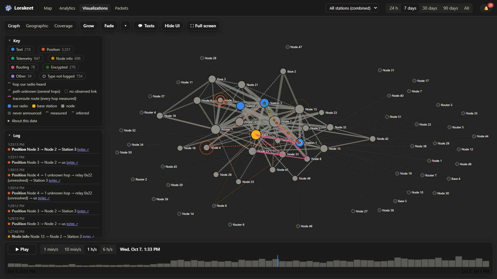
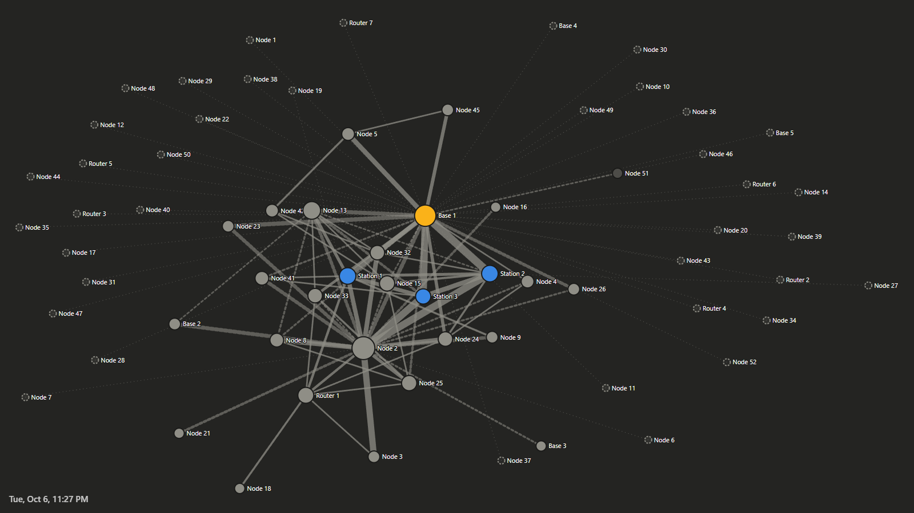
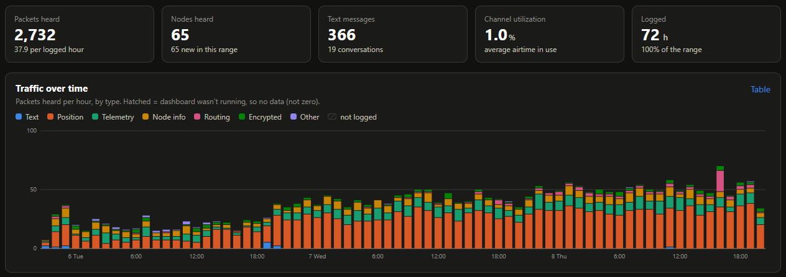
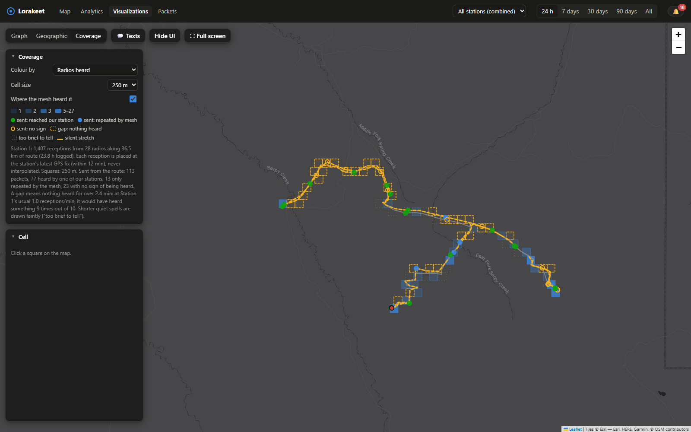
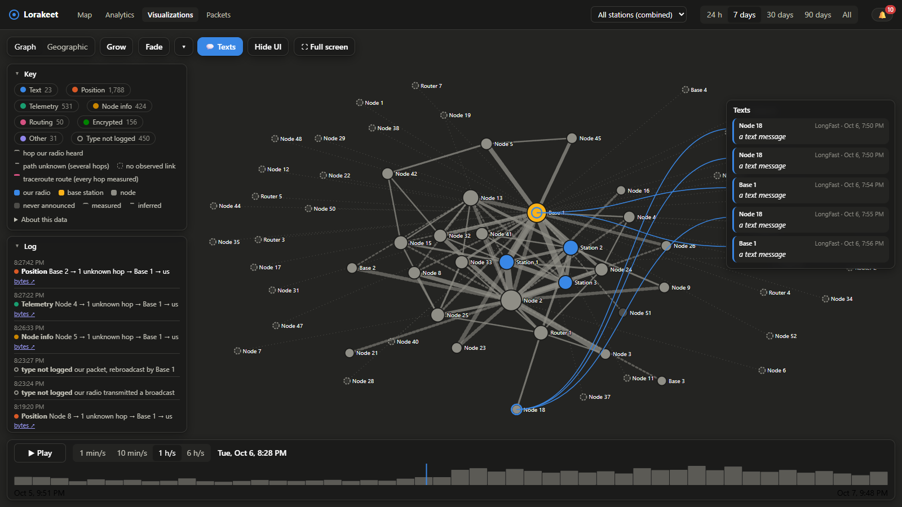
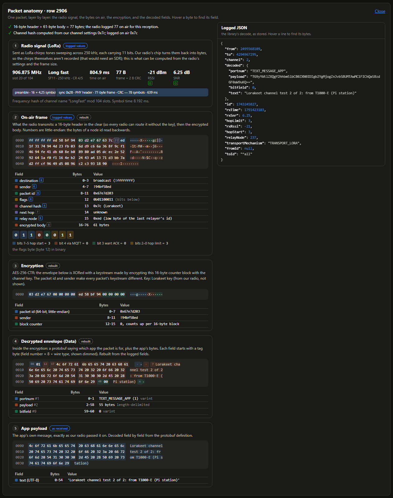

#  Lorakeet

[](https://github.com/darthnut/lorakeet/actions/workflows/tests.yml)

*LoRa + lorikeet: a chatty bird that sits on your mesh and listens to everything.*

Lorakeet is a logger and dashboard for a [Meshtastic](https://meshtastic.org) mesh. Plug a radio into a
computer and it records **everything that radio hears** (every packet, every over-the-air reception
including duplicates, the radio's own debug log) into SQLite, then lets you explore it: a live map,
analytics, the mesh's real topology, packet-level detail and an animated replay of the traffic.

> **v0.2 preview.** It works and runs every day, but it's young: expect rough edges. Feedback and bug
> reports are welcome.

The screenshots and videos here come from a real mesh, anonymized the way Lorakeet does it for sharing
(`?anon=1`): every radio is renamed by role (Station 1, Node 14...), message text is hidden, and on maps the
whole picture is moved onto substitute map tiles of a different place, keeping its shape and distances.

https://github.com/user-attachments/assets/df3ec998-7dcd-4a28-b3d8-80e750c8be72

*Traffic replay, Graph view, one day in 30 seconds. Radios appear as they're first heard (Grow mode) and each
packet travels the path a listening station observed. Names anonymized.*

https://github.com/user-attachments/assets/6cded12b-1df9-49ba-8af9-5b6baf3b39ff

*The same day in the Geographic view, including a station driving around in a truck (its dot follows its GPS
route). Anonymized: names replaced, and the real map swapped for substitute tiles of another place.*



*Traffic replay with the Key and the packet log, mid-playback. Names anonymized.*

## What it does

- **Logs completely.** Every packet as received (full JSON, nothing dropped), plus one row per
  over-the-air reception parsed from the firmware's debug log: who sent it, which relay you heard it
  from, hop counts, SNR/RSSI, frame length. Gaps when the logger wasn't running are shown as gaps, never
  as zeros.
- **Live map and messages.** Nodes, links, positions, a traffic feed, and messaging on any of your
  radio's channels.
- **Analytics.** Traffic by type and hour, channel utilization and airtime, who relays to you, node
  roles and hardware, per-node pages, readable vs private traffic.
- **Topology and replay.** The mesh as a graph of real RF links (measured and inferred), with a replay
  that animates every packet along the path your radio actually observed. *Grow* mode builds the graph as
  radios first appear; *Fade* mode dims radios that go quiet; *Texts* shows the readable text messages in a
  chat panel as the replay reaches them, each linked to its sender. On the map, a moving station's dot
  follows its GPS route. For sharing, `?anon=1` renames every radio, hides message text and moves the whole
  map to a decoy place (same shape and distances, somewhere else); `tools/record-viz.mjs` renders the replay
  to MP4, from short clips for a README to smooth 60 fps.
- **Drive coverage.** Put a station in a car (a Pi with a GPS radio) and the Coverage view maps what it heard
  along the route, square by square, and where the mesh heard *it*: each packet it sent, marked by whether
  one of your other stations heard it, a relay repeated it, or there's no sign it got out. Optional drive
  pings send a tiny message every kilometre to fill that in. Quiet spells only count as gaps once they're
  long enough to mean something at the station's usual packet rate.
- **Ask a station how it's doing, over the mesh.** For a station with no internet (in a car, at a remote
  site): send its radio `lk status` or `lk gps` as a private direct message from a radio you've allowed,
  and it answers. Read-only, off by default.
- **Packet anatomy.** Any packet rebuilt byte by byte, layer by layer (radio, header, encryption,
  envelope, payload), each field labelled with where its value came from.
- **Health and security checks.** Busy channels, misconfigured nodes, known weak keys, duplicate keys,
  possible impersonation. All passive. Radios whose key is on Meshtastic's compromised list, or shared with
  other radios, carry a warning badge wherever they appear (map, node pages, packet browser, replay).
- **Several listening stations.** Small collectors (a Raspberry Pi and a radio) log locally and sync to
  one hub over a private network, so you can compare what different places hear. See
  [docs/PI-SETUP.md](docs/PI-SETUP.md).
- **Alerts and backups.** Watched nodes going silent or low on battery, new nodes, nightly
  integrity-checked database backups to folders you choose.



*Topology: the mesh as a graph of real RF links, measured (solid) and inferred from relays (dashed), with
the controls hidden for recording. Names anonymized.*



*Analytics: the summary tiles and traffic by type over time. Hatched hours are when nothing was logging (a
gap, never a zero).*



*Drive coverage: what a station in a truck heard along the day's routes (blue squares, amber outlines for
real gaps) and where the mesh heard it (dots: green reached another of our stations, blue was repeated by a
relay, hollow amber no sign). Anonymized: stations renamed, and the route shown on substitute tiles of a
different place.*



*The replay's Texts panel: readable messages scroll by as the replay reaches them, each linked to its sender.
Anonymized: names replaced and every message shown only as "a text message".*



*Packet anatomy: one packet rebuilt layer by layer, from the radio signal and the on-air header through the
encryption to the decoded text. Not anonymized, so it's one of our own test messages, between our own radios.*

## Quick start

You need **Python 3.11+** and a Meshtastic radio connected over **USB** or reachable on your **network**
(tested with Heltec V4, Heltec Mesh Node T1 and SenseCAP T1000-E on firmware **2.7.26**).

```sh
git clone https://github.com/darthnut/lorakeet.git
cd lorakeet
python -m venv venv
venv/bin/pip install -r requirements.txt        # Windows: venv\Scripts\pip install -r requirements.txt
venv/bin/python server.py                       # Windows: venv\Scripts\python server.py
```

Open http://127.0.0.1:5190. The first time, a **setup page** asks a few questions (your radio, this station,
privacy and access, storage and maps) and writes `lorakeet.toml` for you; every other option is explained
in `lorakeet.example.toml`, and you can edit the file by hand any time. A USB radio is detected automatically (or set `[radio] port`). For a radio on
your network instead (Wi-Fi or Ethernet boards), set `[radio] host` to its IP address or name. Over the
network you get every decoded packet, but not the per-reception detail below: radios only send their debug
log over USB. `tools/radio_wifi.py` puts an ESP32 radio on your Wi-Fi without typing the password into
your shell.

**For per-reception detail** (relays, duplicates, airtime, replay), turn on the radio's debug log over the
API, once: `meshtastic --set security.debug_log_api_enabled true` (stop Lorakeet first; only one program
can use the serial port at a time). Without it you still get every decoded packet.

**To keep it running:** on Windows, `supervise.pyw` runs it in the background and restarts it if it
stops (start it from Task Scheduler at logon). On Linux, see `deploy/lorakeet.service`.

## Good to know

- **Don't expose it to the internet.** There's no login yet, and the dashboard can transmit (messages,
  traceroutes). By default it only answers on this computer; `[http] lan = "view"` adds read-only access
  from your local network.
- **Listening doesn't transmit.** The only things that transmit are messages and traceroutes you send,
  plus three options that are off unless you turn them on: scheduled traceroutes, drive pings, and replies
  to `lk` commands.
- **What it records about others.** It logs what your radio hears on the shared airwaves, including
  the recipients of other people's addressed packets (on by default; `[logging] store_recipients` turns
  that off). Message contents are only readable on channels you have the key for. Think about this
  before sharing your database or screenshots; the replay's `?anon=1` mode helps.
- **Maps.** OpenStreetMap and OpenTopoMap tiles by default (their usage policies apply: fine for personal
  use). `[map] tiles = "esri"` switches to Esri's maps, including satellite imagery, under Esri's terms.
- **Firmware versions.** Per-reception logging parses the firmware's debug log, whose format can change
  between versions. Tested on 2.7.26. **Firmware 2.8** (in alpha) is prepared for but not yet tested on a real
  2.8 radio: it renumbers radios (Lorakeet joins a radio's old and new numbers into one history), radios on
  2.8 get a "2.8" tag with an adoption count on Analytics, and the known 2.8.1 log change is handled. If an
  update ever stops per-reception logging, Lorakeet raises an alert rather than failing silently.

## How this was built

Lorakeet was written largely with **Claude** (Anthropic's AI model, via Claude Code), directed, tested
and run on a real mesh by a human. [CLAUDE.md](CLAUDE.md) is the working notes file the AI used: how the
code is organised and the rules it follows, which is also a decent map for human contributors.

## Running the tests

```sh
venv/bin/pip install -r requirements-dev.txt
venv/bin/python -m pytest
```

The tests build a small synthetic mesh on the fly (no radio, no real data needed). GitHub Actions runs
them on Linux and Windows for every push and pull request, along with syntax checks and the
personal-details check in `tools/release_check.py`.

## Status and support

A hobby project, maintained on a best-effort basis. Issues and pull requests are welcome, but there are
no promises about response times. Ideas and plans: [docs/STATION-NETWORK-ROADMAP.md](docs/STATION-NETWORK-ROADMAP.md).

**Not affiliated with Meshtastic.** Meshtastic® is a registered trademark of Meshtastic LLC. Lorakeet is an
independent project that talks to Meshtastic radios through the official Python library.

## License

[GPL-3.0](LICENSE). Third-party components and their licenses: [THIRD-PARTY-NOTICES.md](THIRD-PARTY-NOTICES.md).
